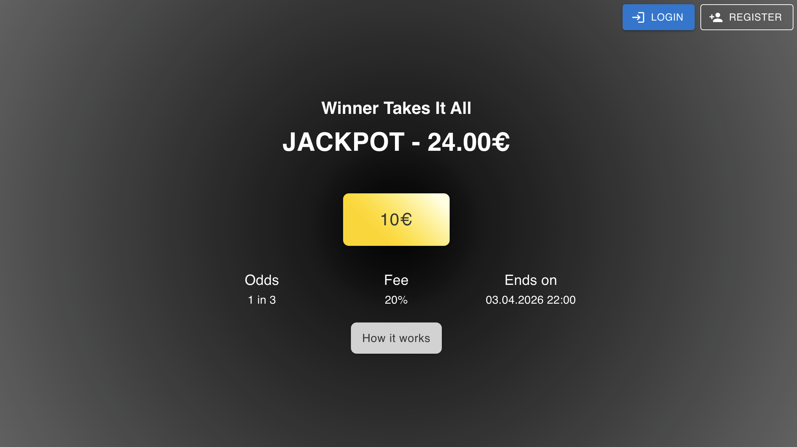
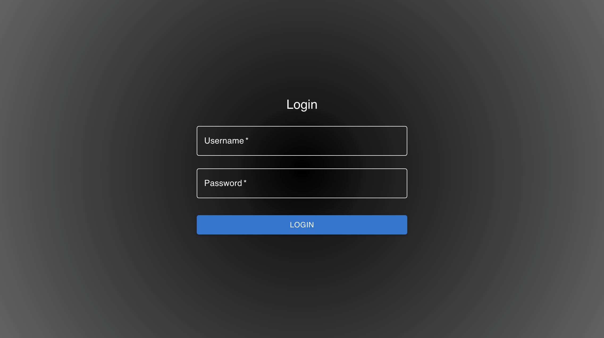
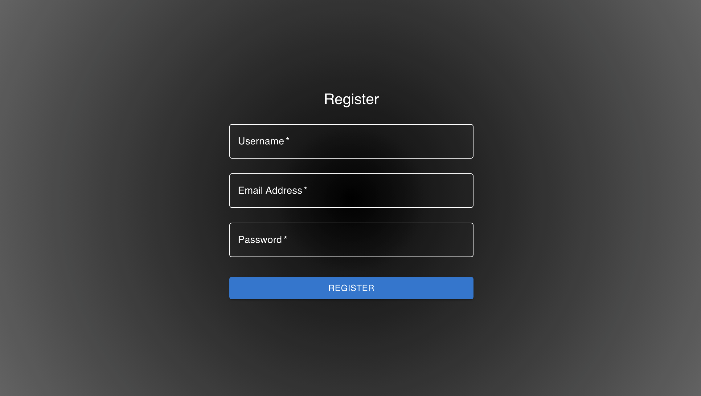
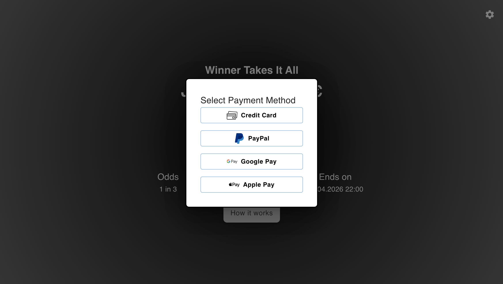
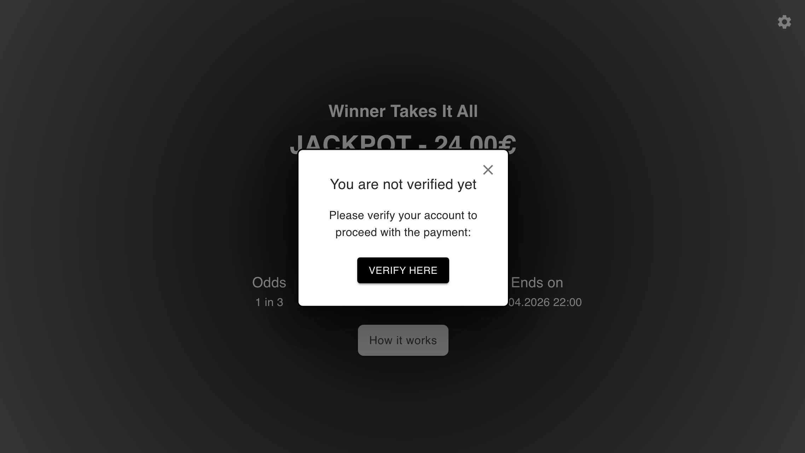
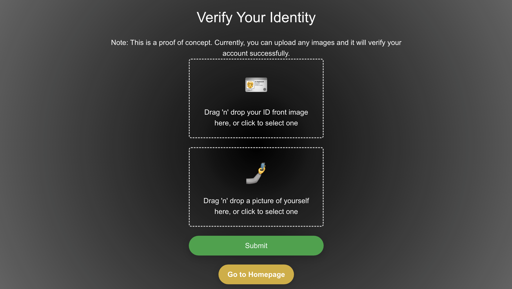
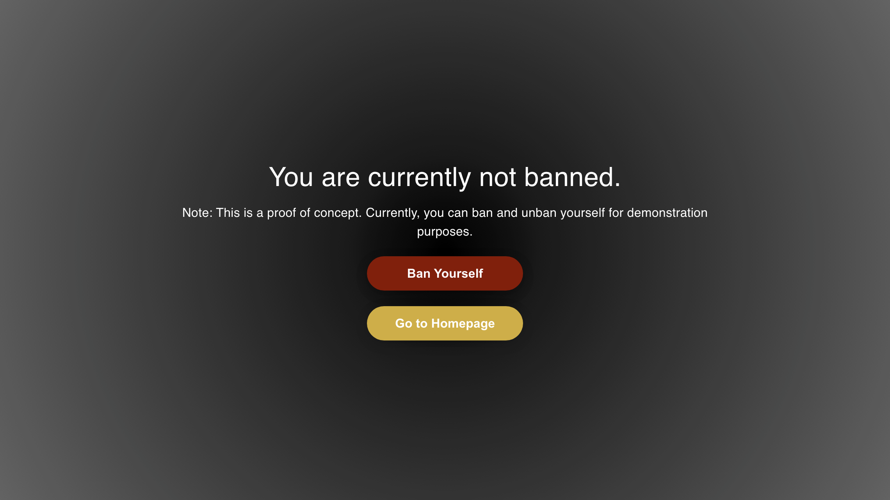
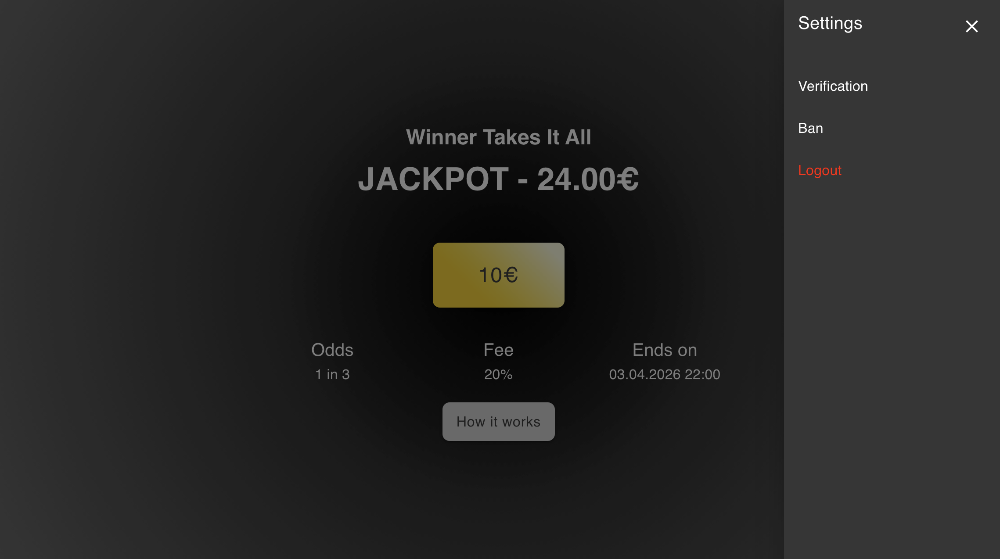
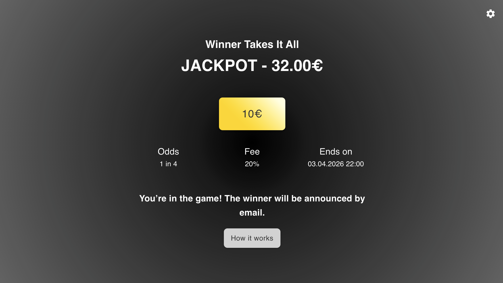

# WinnerTakesItAll

WinnerTakesItAll is a lottery web application where users purchase tickets to participate in a game. At the end of each round, a winner is randomly selected from the pool of participants and receives the total sum collected from all ticket sales.

The platform allows users to register, join games, manage their profiles, and engage in a secure and fair gaming environment.

## Demo

Below are screenshots demonstrating the main features and user flow of WinnerTakesItAll:

### Home / Game Page

### Login & Register

### Payment & Verification

### Ban Management

### Settings

### In-Game State

## Key Features

- **User Registration & Authentication**: Secure sign-up, login, and session management.
- **Game Participation**: Users can join scheduled games, view game status, and track results.
- **Ban Management**: Users can view and toggle their ban status, ensuring fair play.
- **Payments**: Integrated payment system for game entry and rewards.
- **Identity Verification**: Users can upload documents for identity verification to maintain platform integrity.
- **Admin & Moderation Tools**: Support for banning users and managing game schedules.

## High-Level Architecture

- **Frontend**: Built with Next.js and React, styled using Tailwind CSS and Material UI. Provides a responsive and interactive user interface.
- **Backend**: Node.js/TypeScript server with RESTful API endpoints, using ArangoDB for persistent data and Redis for caching and session management.
- **APIs**: OpenAPI/Swagger-documented endpoints for all major features.

## User Flow

1. **Register/Login**: Users create an account or log in.
2. **Verify Identity**: Optionally upload documents for verification.
3. **Join Games**: Participate in a game by purchasing a ticket.
4. **Payments**: Handle entry fees and receive rewards.
5. **Ban Status**: Check and manage ban status if applicable.

## Setup Instructions

For setup instructions, see the README files in the `frontend/` and `backend/` directories.
